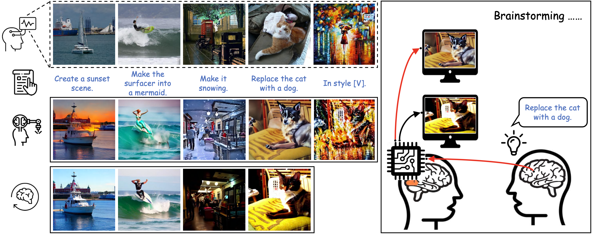
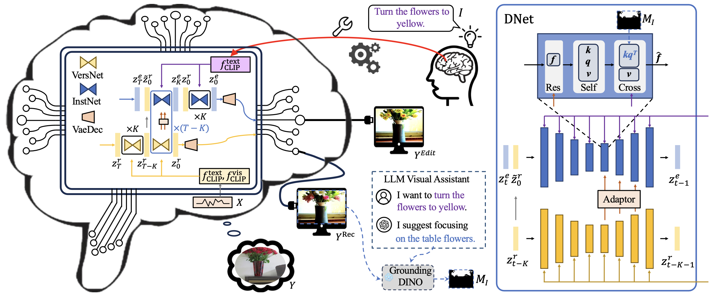

# Connecting Dreams with Visual Brainstorming Instruction (Visual Intelligence)
[Yasheng Sun](https://scholar.google.com/citations?user=Vrq1yOEAAAAJ&hl=en), [Bohan Li](https://arlo0o.github.io/libohan.github.io/), [Mingchen Zhuge](https://scholar.google.com/citations?user=Qnj6XlMAAAAJ&hl=en&oi=ao), [Deng-Ping Fan](https://scholar.google.com/citations?user=kakwJ5QAAAAJ&hl=en&oi=ao), [Salman Khan](https://scholar.google.com/citations?user=M59O9lkAAAAJ&hl=en&oi=ao), [Fahad Shahbaz Khan](https://scholar.google.com/citations?user=zvaeYnUAAAAJ&hl=en&oi=ao),
[Hideki Koike](https://scholar.google.com/citations?user=Ih8cJXQAAAAJ&hl=en)
<!-- # Code and Project Coming Soon! Please Stay Tuned! -->



### [Paper](https://arxiv.org/pdf/2408.07317)

We aim to develop a straightforward framework that uses other modalities, such as natural language, to translate the original “dreamland”. We present DreamConnect, employing a dual-stream diffusion framework to manipulate visually stimulated brain signals. By integrating an asynchronous diffusion strategy, our framework establishes an effective interface with human “dreams”, progressively refining their final imagery synthesis.




# Table of Content
- [News](#news)
- [Installation](#step-by-step-installation-instructions)
- [Prepare Data](#prepare-data)
- [Pretrained Model](#pretrained-model)
- [Testing](#testing)
- [License](#license)
- [Acknowledgements](#acknowledgements)


# News
- [2024/08]: Paper is on [Arxiv](http://arxiv.org/abs/2408.07317).
- [2024/12]: Paper is accepted by [Visual Intelligence](https://link.springer.com/journal/44267).

# Step-by-step Installation Instructions

**a. Create a conda virtual environment and activate it.**
It requires python >= 3.7 as base environment.
```shell
conda create -n sssp python=3.7 -y
conda activate sssp
```

**b. Install PyTorch and torchvision following the [official instructions](https://pytorch.org/).**
```shell
conda install pytorch==1.10.0 torchvision==0.8.2 -c pytorch -c conda-forge
```

**c. Install other dependencies.**
We simply freeze our environments. Other environments might also works. Here we provide requirements.txt file for reference.
```shell
pip install -r requirements.txt
```
Note that the transformers==1.19.2 is strictly required.

# Prepare Data
- Agree to the Natural Scenes Dataset's [Terms and Conditions](https://cvnlab.slite.page/p/IB6BSeW_7o/Terms-and-Conditions) and fill out the NSD Data [Access form](https://docs.google.com/forms/d/e/1FAIpQLSduTPeZo54uEMKD-ihXmRhx0hBDdLHNsVyeo_kCb8qbyAkXuQ/viewform).

- Our Customized Dataset. The editing instructions are located `in third_party/StableDiffusionReconstruction/codes/utils/misc` directory.
The obtained images after instruction can be downloaded from [nsd_coco_output.tar](https://1drv.ms/f/c/7c0cd8158f160d40/EojCbdnGLhBPky_DLW0DYsYBPdaAxIKPbxYzdnLEY7jWbg?e=f7UezW).

# Pretrained Model
- Download [Pretrained model](https://1drv.ms/f/c/7c0cd8158f160d40/EojCbdnGLhBPky_DLW0DYsYBPdaAxIKPbxYzdnLEY7jWbg?e=f7UezW) and put it to `logs/train_res_inject_idback_train_res_inject_idback_2024-04-22/checkpoints/ckpt_epoch_50/mp_rank_00_model_states.pt` accordingly.


# Testing

# Instructions for Testing and Training the Model

## Step 1: Update the Checkpoint Path
Open the configuration file located at `configs/test/test_res_value_inject_idback_css15.yaml` and update the checkpoint path to match the paths of the downloaded models.

- Download the pre-trained language-based instruction [model](https://mailustceducn-my.sharepoint.com/:u:/g/personal/aa397601_mail_ustc_edu_cn/EWlNmyeS9P1BkRg_IlXbPbwBeNMQXQTcIA0pCokyd61UWg?e=iKfRdk) provided by [InstructDiffusion](https://github.com/cientgu/InstructDiffusion).

## Step 2: Pre-Aligned Features for Convenience
For ease of use, we provide the following pre-aligned features:  
- [fMRI-aligned VAE features (fmri_vae.zip)](https://1drv.ms/f/c/7c0cd8158f160d40/EojCbdnGLhBPky_DLW0DYsYBPdaAxIKPbxYzdnLEY7jWbg?e=f7UezW)  
- [Aligned image features (img_clip.zip)](https://1drv.ms/f/c/7c0cd8158f160d40/EojCbdnGLhBPky_DLW0DYsYBPdaAxIKPbxYzdnLEY7jWbg?e=f7UezW)  
- [Aligned text features (text_clip.zip)](https://1drv.ms/f/c/7c0cd8158f160d40/EojCbdnGLhBPky_DLW0DYsYBPdaAxIKPbxYzdnLEY7jWbg?e=f7UezW)


If you are interested in training a alignment [model](https://1drv.ms/f/c/7c0cd8158f160d40/EojCbdnGLhBPky_DLW0DYsYBPdaAxIKPbxYzdnLEY7jWbg?e=f7UezW) by yourself, please follow the overall procedure [fMRI-reconstruction-NSD](https://github.com/MedARC-AI/fMRI-reconstruction-NSD).

We provide the our trained alignment module for img_clip and text_clip. Download them and place to the directory of `train_logs/latent_diffusion_image_fp32_resume/` and `train_logs/latent_diffusion_text_fp32_resume2/` accordingly. 

Then, you can run below commands to obtain the above provided img_clip and text_clip files.
```
bash experiments/diffusion_test.sh image
bash experiments/diffusion_test.sh text
```

## Step 3: Testing the Model
Once the paths are updated, you can test the model by running the following command:

```bash
bash experiments/test_language_control.sh
```


<!-- 
- Please check the checkpoint path in `configs/test/test_res_value_inject_idback_css15.yaml` and replace it with the downloaded paths accordingly. Specificially, download the pre-trained language based instruction [model](https://mailustceducn-my.sharepoint.com/:u:/g/personal/aa397601_mail_ustc_edu_cn/EWlNmyeS9P1BkRg_IlXbPbwBeNMQXQTcIA0pCokyd61UWg?e=iKfRdk) from [InstructDiffusion](https://github.com/cientgu/InstructDiffusion).
- Note that [here](https://1drv.ms/f/c/7c0cd8158f160d40/EojCbdnGLhBPky_DLW0DYsYBPdaAxIKPbxYzdnLEY7jWbg?e=f7UezW) we directly provides the fMRI-aligned VAE features (fmri_vae.zip), aligned image features (img_clip.zip) and aligned text features (text_clip.zip) for convenience. 
- Then, you can run below commands to test the model.
```
bash experiments/test_language_control.sh 
```
- If you are interested in training a alignment module by yourself, please follow the overall procedure [fMRI-reconstruction-NSD](https://github.com/MedARC-AI/fMRI-reconstruction-NSD). Here we also directly provide our trained alignment module for img_clip and text_clip. You can download them and put them to `train_logs/latent_diffusion_image_fp32_resume/` and `train_logs/latent_diffusion_text_fp32_resume2/` accordingly. 
Then, you can run below commands to obtain the above provided img_clip and text_clip files.
```
bash experiments/diffusion_test.sh image
bash experiments/diffusion_test.sh text
``` -->


# Acknowledgements
Many thanks to these excellent open source projects: 
- [InstructPix2Pix] (https://github.com/timothybrooks/instruct-pix2pix)
- [fMRI-reconstruction-NSD] (https://github.com/MedARC-AI/fMRI-reconstruction-NSD)
- [Versatile-Diffusion] (https://github.com/SHI-Labs/Versatile-Diffusion)
- [Stable-Diffusion] (https://github.com/CompVis/stable-diffusion)
- [InstructDiffusion] (https://github.com/cientgu/InstructDiffusion)


# Citation
If you find our paper and code useful for your research, please consider citing:
```bibtex
@misc{sun2024connectingdreamsvisualbrainstorming,
      title={Connecting Dreams with Visual Brainstorming Instruction}, 
      author={Yasheng Sun and Bohan Li and Mingchen Zhuge and Deng-Ping Fan and Salman Khan and Fahad Shahbaz Khan and Hideki Koike},
      year={2024},
      eprint={2408.07317},
      archivePrefix={arXiv},
      primaryClass={cs.HC},
      url={https://arxiv.org/abs/2408.07317}, 
}
```